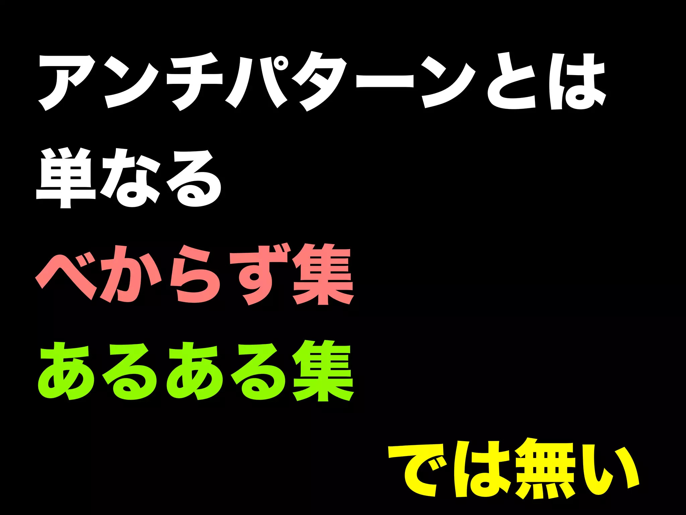
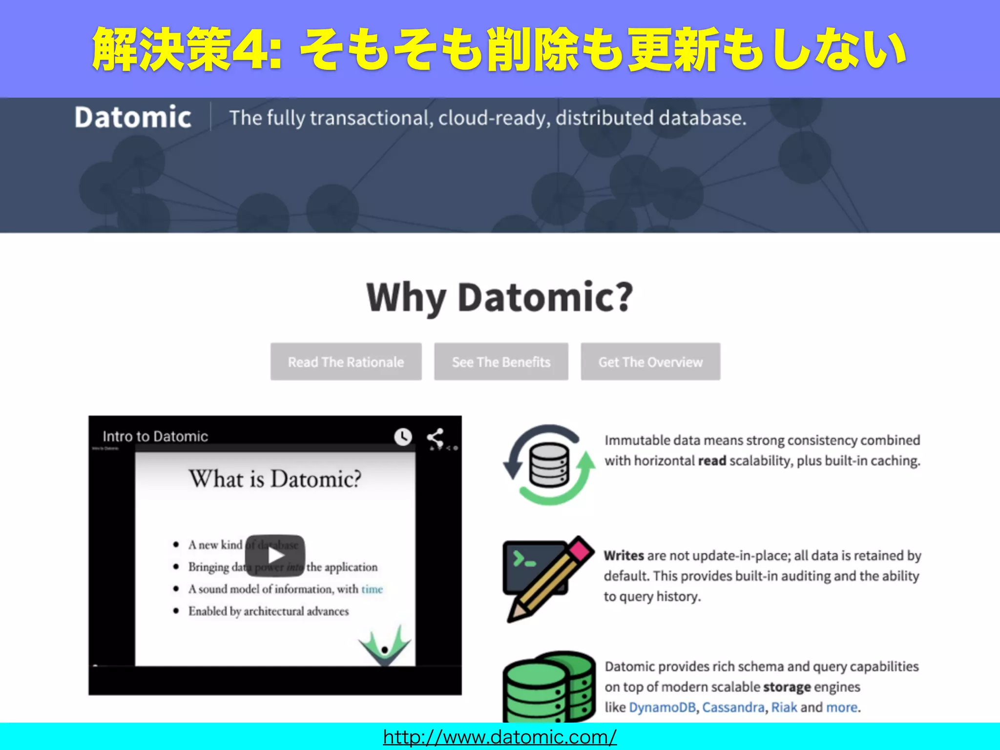

# SQLアンチパターン 幻の第26章「とりあえず削除フラグ」

<table>
    <tr>
        <td>著者</td>
        <td>Takuto Wada</td>
    </tr>
    <tr>
        <td>引用元</td>
        <td><a href="https://www.slideshare.net/t_wada/ronsakucasual" target="_blank" rel="nofollow noopener noreferrer">https://www.slideshare.net/t_wada/ronsakucasual</a></td>
    </tr>
    <tr>
        <td>ライセンス</td>
        <td><a href="https://creativecommons.org/licenses/by/4.0/" target="_blank" rel="nofollow noopener noreferrer">CC BY 4.0</a></td>
    </tr>
</table>

